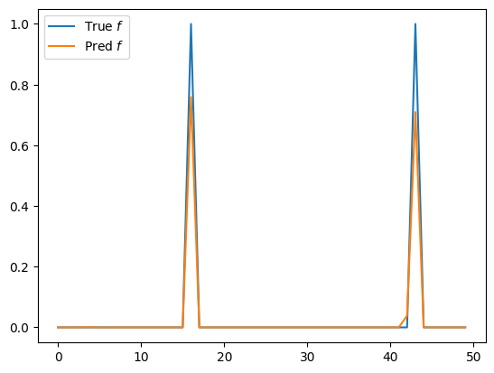

# Preliminaries

### Import necessary libraries
We'll need PyTorch and numpy for tensor/array operations, and matplotlib for visualization.

```python
import torch
import numpy as np
import matplotlib.pyplot as plt
```

# Introduction to **Compressed Sensing**


Consider the problem of measuring some signal $x$.
With the prior knowledge that the signal is sparse in some domain, Compressed Sensing can be used to recover it in far less measurements than would typically be required (according to Nyquist-sampling). To begin, we will start with a very very simple example, that demonstrates how this can work. Then throughout this notebook, I will explain in more detail the fundamental requirements and methods associated with this technique, including **Sparsity**, **Incoherence** and why the minimization of the **L1 norm allows us to recover sparse solutions**. Before any of that,  we must define a measurement.

For the simple case that $x$ is a vector of length 4.

### Measurement
Here, our measurement device is only capable of integrating over the signal (much like a camera has an integration time). We can however, apply some known modulation, $\Phi_{i}$ ,  to the signal as the measurement is taken. A measurement is then  $y_{i} = \Phi_{i}\cdot x$. For example, if we wanted to know what was in the first element of $x$, we could use a sampling vector of the form $\Phi_{i} = [1,0,0,0]$.
The most obvious way of measuring the full signal, is to perform $4$ measurements of this sort, to look in each element. These sampling vectors can be put together into the sampling matrix $\mathbf{\Phi}$, which will have the form of an identity matrix.


$ \mathbf{\Phi} = \begin{bmatrix}
1 & 0 & 0  & 0 \\
0 & 1 & 0  & 0 \\
0 & 0 & 1  & 0 \\
0 & 0 & 0 & 1 \\
\end{bmatrix}$


```python
s = 4 #define signal domain size

x = torch.zeros(s)
x[torch.randint(0,4,size=(1,))] = torch.rand(1)* 0.5 + 0.25 #our unknown signal

phi = torch.eye((4)) # representing 4 measurements, looking in each element

y = phi@x #the measured signal


'''  Visualise  '''
fig,ax = plt.subplots(1,3,dpi=200,gridspec_kw={'width_ratios': [4, 1, 4]})

ax[0].imshow(phi,vmax=1,vmin=0);ax[0].set_title(r'$\Phi$');ax[0].set_axis_off()
ax[1].imshow(x.unsqueeze(1),vmax=1,vmin=0);ax[1].set_title(r'$x$');ax[1].set_axis_off()
ax[2].imshow(y.unsqueeze(0),vmax=1,vmin=0);ax[2].set_title(r'$y$');ax[2].set_axis_off()
fig.text(0.565,0.49,'=')

for (j,i),label in np.ndenumerate(phi):
    ax[0].text(i,j,label,ha='center',va='center')

for (j,i),label in np.ndenumerate(x.unsqueeze(1)):
    ax[1].text(i,j,'x'+str(j),ha='center',va='center')
    ax[2].text(j,i,'y'+str(j),ha='center',va='center')

```


    

    


### **A very simple Compressed Sensing example**

Now imagine that we are given the information that the signal is **sparse**, and that only one of its elements is non-zero.

In this case, the identity matrix turns out to be a very inefficient way of measuring this signal. For a very basic demonstration of the use of a better measurement matrix, see the following. In the resultant measurement vector,  $y_{0}$ gives us the magnitude of the signal, and $\frac{3y_{1}}{y_{0}}$ gives us the element.


```python

phi = torch.ones((2,4))
phi[1] = torch.linspace(0,1,4) # the new measurement matrix

y = phi@x #take measurement

'''  Visualise '''

fig,ax = plt.subplots(1,3,dpi=200,gridspec_kw={'width_ratios': [4, 1, 2]})
ax[0].imshow(phi,vmax=1,vmin=0);ax[0].set_title(r'$\Phi$');ax[0].set_axis_off()
ax[1].imshow(x.unsqueeze(1),vmax=1,vmin=0);ax[1].set_title(r'$x$');ax[1].set_axis_off()
ax[2].imshow(y.unsqueeze(0),vmax=1,vmin=0);ax[2].set_title(r'$y$');ax[2].set_axis_off()
fig.text(0.675,0.49,'=')

for (j,i),label in np.ndenumerate(phi):
    ax[0].text(i,j,np.round(label,2),ha='center',va='center')

for (j,i),label in np.ndenumerate(x.unsqueeze(1)):
    ax[1].text(i,j,'x'+str(j),ha='center',va='center')

for (j,i),label in np.ndenumerate(y.unsqueeze(0)):
    ax[2].text(i,j,'y'+str(i),ha='center',va='center')
```


    

    


We have now seen how a choice of measurement matrix can lead to recovery of the signal in much fewer measurements. Now we will consider a more complicated example, and look at the conditions for compressed sensing, starting with condition 1:

### **1. Sparsity:** the real-world signal, $x$, can be described by $x = \Psi f$; where $f$ is a sparse representation, and $\Psi$ is the sparse basis matrix.

*This condition is intuitive; if it is possible to capture the signal in less measurements, it makes sense that it needs to have redudancy*.

*Now we consider the case where $x$ is sparse in the Discrete Cosine Basis.*


```python
def create_dct_matrix(domain):
    n = len(domain)
    dct_matrix = torch.zeros((n, n))
    for j in range(n):
        dct_matrix[j] = (1/n)**0.5 * torch.cos((torch.pi * (j + 1/2) * domain) / (n))
    return dct_matrix

n = 50
domain = torch.linspace(0,20,n) #define our domain

sparse_basis = create_dct_matrix(domain) #define the discrete cosine basis.

f = torch.zeros(n)
f[torch.randint(0,n,size=(2,))] = 1 #the sparse vector, with two non-zero components

x = sparse_basis @ f #our real-space signal.


fig,ax = plt.subplots(1,3,dpi=100,figsize=(10,3))
ax[0].imshow(sparse_basis); ax[0].set_title(r'Sparse Basis, $\psi$')
ax[1].plot(f); ax[1].set_title(r'Sparse Basis Signal, $f$')
ax[2].plot(x); ax[2].set_title(r'Real-world Basis Signal, $x$')

```


    Text(0.5, 1.0, 'Real-world Basis Signal, $x$')


    

    


As discussed above, we could use the identity sampling matrix to perform $n$ measurements, looking through each element one-by-one in order to recover the signal. But can we recover the signal in $m\ll n$ measurements, by using a clever sampling process?

To determine the ideal type of sampling vector, $\Phi_{i}$, we express the measurement process in terms of the sparse signal, $f$:


### $y_i = \Phi_i x  = (\Phi_i \mathbf{\Psi}) f,\:\:$


where $(\Phi_i \mathbf{\Psi})$ describes the way that we are sampling the sparse vector $f$.


**Crucially, to reliably recover the signal we must sample the whole sparse signal. Otherwise, if the non-zero element is outside our sampling region, it is invisible.**
#### *Lets first consider a measurement where we sample in the same basis that the signal is sparse*


```python
n_measurements = 10
sampling_matrix = sparse_basis[torch.randperm(n)[:n_measurements]] #take 5 measurements from rows of the sparse basis.

PhiPsi = sampling_matrix@sparse_basis #the thing that will be applied to f

plt.imshow(PhiPsi); plt.title(r'$\Phi\Psi$');plt.axis('off')
```


    (-0.5, 49.5, 9.5, -0.5)


    

    


We see that this is a bad sampling basis, as each measurement only samples a tiny portion of the sparse vector. This should not be suprising of course... this is the sparse basis after all, so each row should correspond to a single element of the sparse vector.

**This shows that if a sampling vector is highly correlated with a row of the sparse basis, the measurement will sample a tiny portion of $f$**.

A metric that can measure the maximum correlation between a sampling vector and any row of the sparse basis is **Coherence**.

### $C(\Psi,\Phi) = \sqrt{n} \underset{1\leq i,j \leq n}{\textrm{max}} \left|\Phi_i \cdot\Psi_j\right| $

Finding a sampling matrix that minimizes coherence ensures that every measurement samples a large amount of $f$. This leads us well into the 2nd condition of Compressed Sensing:

### **2. Incoherence:** The sampling matrix must be incoherent with respect to the sparse basis.


Lets check the coherence between some sampling matrices


```python
def correlation(a,b):
    return torch.dot(a, b)


def coherence(sparse_basis, sampling_basis):
    '''
    As defined in Candes paper
    '''
    sx,sy = sparse_basis.shape
    sx2,_ = sampling_basis.shape

    max_correlation = 0

    for i in range(sx):
        for j in range(sx2):
            corr = (sy)**0.5 * torch.abs(correlation(sparse_basis[i] , sampling_basis[j]))
            if corr>max_correlation:
                max_correlation=corr
    return max_correlation


print(f'Coherence with the Sparse Basis: {coherence(sparse_basis,sparse_basis[torch.randperm(n)[:n_measurements]])}')

identity_matrix = torch.eye(n)
print(f'Coherence with the Identity Basis: {coherence(sparse_basis,identity_matrix[torch.randperm(n)[:n_measurements]])}')
```

    Coherence with the Sparse Basis: 3.7036516666412354
    Coherence with the Identity Basis: 1.0
    

### Here the identity basis is actually a perfect choice to perform our sampling.

Taking a look at the form of $(\Phi_i \mathbf{\Psi})$, we see that the sparse vector will be well sampled with nearly every measurement.


```python
n_measurements = 10
sampling_matrix = identity_matrix[torch.randperm(n)[:n_measurements]] #take 5 measurements from rows of the identity basis.

PhiPsi = sampling_matrix@sparse_basis

plt.figure(figsize = (5,20))
plt.imshow(PhiPsi); plt.title(r'$\Phi\Psi$');plt.axis('off')
```


    (-0.5, 49.5, 9.5, -0.5)


    

    


```python
y = sampling_matrix@x
plt.imshow(y.unsqueeze(0))
```


    <matplotlib.image.AxesImage at 0x7f1070abf580>


    

    


## Recovering $f$

Okay so we've seen that its important to create a measurement matrix to sample the full sparse vector. But how can we recover it once we have our measurement?

Compressed sensing deals with an under-determined system of equations:  $y=(\Phi \Psi) f$. There are many possible $f$ that satisfy this equation, but we are looking for the most sparse one. Thus, the equation we wish to solve is:

### $\\textrm{min}_{\\tilde{f}} |\\tilde{f}|_{0} \:\:\: \textrm{subject to}\:\:\: y = (\Phi\Psi) \tilde{f},$

where $| |_{0}$ denotes the L0 norm (counting non-zero elements). However, this is not a very nice function to optimize, as the L0 norm is not smooth. Candes *et al.* found that minimizing the L1 norm can actually find the sparse solution in most situations. For the next discussion we will look into why this is possible.

#### *Consider a simple example with two elements in $f$...*


```python
PhiPsi_small = torch.tensor([[0.6,0.4]])

y_small = torch.tensor([1])
```


```python
f_small = torch.tensor([0,0])

import numpy as np

fig,ax = plt.subplots(1,3,dpi=150,gridspec_kw={'width_ratios': [2, 1, 1]})
ax[0].imshow(PhiPsi_small,vmax=1,vmin=0);ax[0].set_title(r'$\Phi\Psi$');ax[0].set_axis_off()
ax[1].imshow(f_small.unsqueeze(1),vmax=1,vmin=0);ax[1].set_title(r'$f$');ax[1].set_axis_off()
ax[2].imshow(y_small.unsqueeze(0),vmax=1,vmin=0);ax[2].set_title(r'$y$');ax[2].set_axis_off()

for (j,i),label in np.ndenumerate(PhiPsi_small):
    ax[0].text(i,j,label,ha='center',va='center')

ax[2].text(0,0,y_small.numpy()[0])

fig.text(0.69,0.49,'=')
fig.text(0.60,0.40,'?',color='w')
fig.text(0.60,0.57,'?',color='w')
```


    Text(0.6, 0.57, '?')


    

    


#### Now lets look at possible values of $f_0$ and $f_1$ that will satisfy this equation.


```python
threshold = 0.01

f0_range = torch.linspace(-4,4,500) #possible values of f0
f1_range = torch.linspace(-4,4,500)

save_indices = []

for i in f0_range:
    for j in f1_range:
        f_pred = torch.tensor([i,j])
        y_pred = PhiPsi_small@f_pred

        if torch.abs(y_pred - y_small) < threshold:
            save_indices.append([float(i),float(j)]) #if the loss is below a threshold, save the values.

save_indices = torch.tensor(save_indices)

plt.figure()
plt.scatter(save_indices[:,0],save_indices[:,1],s=0.9, label='solutions');
plt.axhline(0, color='black')
plt.axvline(0, color='black')
plt.xlabel(r'$f_{0}$')
plt.ylabel(r'$f_{1}$')

#### L0 ####

L0_indices_y = [0, save_indices[:,1][np.abs(save_indices[:,0]).argmin()]]
L0_indices_x = [save_indices[:,0][np.abs(save_indices[:,1]).argmin()], 0]
plt.plot(L0_indices_x, L0_indices_y,'r*',label='L0 min')

plt.legend()

```


    <matplotlib.legend.Legend at 0x7f1071f58100>


    

    


**In order to get a sparse solution, we desire the ones where the line of solutions passes through either the $f_{0}$ or $f_{1}$ axis (as this means a coefficient is 0).**

#### Lets visualise the L1, and L2 norms to see where minimizing them will intersect with the line of solutions.

#### ***Starting with L2, minimizing from left to right***


```python
fig, ax = plt.subplots(1,3,dpi=200)

l2_norm_min = torch.norm(save_indices,p=2,dim=1).min()


L2 = [l2_norm_min*2.5,l2_norm_min*1.75,l2_norm_min]
# fig.suptitle('L0')

for i in range(3):
    ax[i].set_aspect('equal')

    ax[i].scatter(save_indices[:,0],save_indices[:,1],s=0.9, label='solutions');
    ax[i].axhline(0, color='black')
    ax[i].axvline(0, color='black')
    ax[i].set_xlabel(r'$f_{0}$')
    ax[i].set_ylabel(r'$f_{1}$')
    ax[i].set_xlim([-4,4])
    ax[i].set_ylim([-4,4])
    ax[i].set_title(f'L2={np.round(L2[i],2):5.5g}')

    #### L0 ####

    L0_indices_y = [0, save_indices[:,1][np.abs(save_indices[:,0]).argmin()]]
    L0_indices_x = [save_indices[:,0][np.abs(save_indices[:,1]).argmin()], 0]
    ax[i].plot(L0_indices_x, L0_indices_y,'r*',label='L0 min',markersize=1)


    from matplotlib.patches import Rectangle, Circle


    ax[i].add_patch(Circle((0,0),L2[i],facecolor='None',edgecolor='g',label='L1 Equi'))


ax[0].legend(fontsize=4)
```


    <matplotlib.legend.Legend at 0x7f1072124a30>


    

    


**We see that minimizing L2 does not generally take us to a sparse solution**

### ***How about L1...***


```python
fig, ax = plt.subplots(1,3,dpi=200)

l1_norm_min = torch.norm(save_indices,p=1,dim=1).min()


L1 = [l1_norm_min*2.2,l1_norm_min*1.7,l1_norm_min]
# fig.suptitle('L0')

for i in range(3):
    ax[i].set_aspect('equal')

    ax[i].scatter(save_indices[:,0],save_indices[:,1],s=0.9, label='solutions');
    ax[i].axhline(0, color='black')
    ax[i].axvline(0, color='black')
    ax[i].set_xlabel(r'$f_{0}$')
    ax[i].set_ylabel(r'$f_{1}$')
    ax[i].set_xlim([-4,4])
    ax[i].set_ylim([-4,4])
    ax[i].set_title(f'L1={np.round(L1[i],2):5.5g}')

    #### L0 ####

    L0_indices_y = [0, save_indices[:,1][np.abs(save_indices[:,0]).argmin()]]
    L0_indices_x = [save_indices[:,0][np.abs(save_indices[:,1]).argmin()], 0]
    ax[i].plot(L0_indices_x, L0_indices_y,'r*',label='L0 min',markersize=1)


    from matplotlib.patches import Rectangle, Circle


    ax[i].add_patch(Rectangle((0,-L1[i]),np.sqrt(2)*L1[i],np.sqrt(2)*L1[i],angle=45,facecolor='None',edgecolor='g',label='L1 Equi'))


ax[0].legend(fontsize=4)
```


    <matplotlib.legend.Legend at 0x7f10723509d0>


    

    


### **We see that minimizing L1 takes us to one of the L0 minimiums!**
### More specifically, it will always hit the L0 minimum if the relationship is linear, due to the square shape of its contour, with the vertices on the feature axis.

### *Lets return to our cosine transform example, and minimize the L1 norm*


```python
f_guess = torch.nn.Parameter(torch.ones(n)*0.0001)

l1_factor= 0.007

optimizer = torch.optim.SGD([f_guess],lr = 0.0008)


def proximal_l1(x, lambda_l1):
    return torch.sign(x) * torch.relu(torch.abs(x) - lambda_l1)


epochs = 2000
store_loss = []

for i in range(epochs):

    if i%100 == 0:
      print(i)

    y_guess = sampling_matrix@sparse_basis@f_guess

    loss =    torch.nn.MSELoss()(y,y_guess) + l1_factor * torch.norm(f_guess,p=1)
    loss.backward()
    optimizer.step()

    f_guess.data = proximal_l1(f_guess,l1_factor)
    f_guess.data = torch.relu(f_guess)


    store_loss.append( torch.nn.MSELoss()(y,y_guess).detach() )

    # if (i>5) and (torch.mean(torch.tensor(store_loss)[i-5:i-1] - torch.tensor(store_loss)[i-4:i]) < 0):
    #   break #early stopping

plt.figure()
plt.plot(store_loss)

plt.figure()
plt.plot(f)
plt.plot(f_guess.detach())
plt.legend([r'True $f$',r'Pred $f$'])

```

    0
    100
    200
    300
    400
    500
    600
    700
    800
    900
    1000
    1100
    1200
    1300
    1400
    1500
    1600
    1700
    1800
    1900
    


    <matplotlib.legend.Legend at 0x7f1072127730>


    

    


    

    


